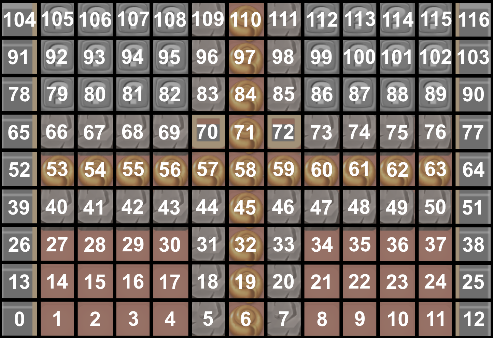

# Overview

In order to communicate with the game simulator and enable easy use of various reinforcement learning (RL) methods, we have set up an [OpenAI Gym](https://gym.openai.com/docs/) environment for the game.
The main aspects of this implementation are the `step` and `reset` methods.
* `step` simulates performing a tap on a boardpiece and returns the observation, reward, *done* and info.
* `reset` starts the current level and returns the first observation of the level.
Additional information and methods are detailed in the following *Environment* section.

The purpose for providing this is to get started quickly, but you are free to modify the environment (such as reward function or observation space) for this competition in any way you want.

## Environment description

### Action space

Since the game board has 9 rows and 13 columns, there are 9 * 13 = 117 possible actions. The actions are therefore mapped as following to the game board:


### Observation space

#### Board representation

Since there are about 40 distinct game board pieces and additional permutations with color, we have chosen to describe the game board using attributes of the pieces in each position. For this, we have chosen the `m=24` mechanics listed below, leading to a 3D observation space with shape `(9 x 13 x m)`. The hitpoints of the board piece is used to represent the piece in the respective layer. If multiple pieces are stacked on top of each other, the hitpoints in the respective cells are simply added together.

Channel | Name | Description
--- | --- | ---
0|Cell|Activated parts of the game board where board pieces can fill up the space.
1-6|Colours|Layer representing each of the 6 colors. All colors are mechanically the same.
7-8|Clickable true/false|Whether a board piece may be clickable. Clickable board pieces are basic tile and power pieces but it does **NOT** imply tapping on said piece is a valid move. Any other board piece is non-clickable, such as rocks or other kinds of blockers.
9|Collectgoal|Remaining collectgoal in the specific coordinate.
10|Basic piece|Standard board piece.
11|Bomb|Bomb power pieces.
12|Flask|Flask power piece.
13-14|Rocket horizontal/vertical|Rocket power piece with the direction.
15|Gravity|Whether a board piece has gravity. If so, the board piece will fall down if the cell below is empty. Otherwise it will stay in place.
16|Spreadable|Typically grass pieces which can spread if none of the pieces are attacked in the previous.
17|Healable|Regenerates 1 HP if not attacked, requiring two or more consecutive attacks to clear.
18|Spawner|Will spawn some board piece (typically collectgoals) when attacked.
19|Colorable|Can take on the color the piece is attack with or random if done with power piece.
20-23|Hittable by piece / neighbor / power / cluster|How a board piece can be attacked. Piece: tap on single piece. Neighbor: matching adjacent pieces. Power: hittable by power pieces. Cluster: tap on 2+ pieces together.

As an example, a basic red piece with 1 hitpoint in index position (0, 0) [lower left corner] that is also a collectgoal will be represented by:

```python
obs[0, 0, 1] = 1
obs[0, 0, 7] = 1
obs[0, 0, 9] = 1
obs[0, 0, 15] = 1
obs[0, 0, 22] = 1
obs[0, 0, 23] = 1
```

while a rock with no gravity and 2 hitpoints is represented as:

```python
obs[0, 0, 8] = 2
obs[0, 0, 21] = 2
obs[0, 0, 22] = 2
```

#### Game state

In addition to the 3D representation of the game board, additional information is also provided in the output from the simulator.

Name | Type | Description
--- | --- | ---
`boardSize`|**tuple\<int\>**|Board size in simulator, used to verify size.
`normList`|**list\<int\>**|Suggested normalisation values for each channel.
`collectGoalRemaining`|**int**|Number of collectgoals remaining. Does not differentiate between types.
`collectGoalGoal`|**int**|Required collectgoals to complete level. Only valid in the 0'th step (reset).


### Info dictionary
When taking a `step`, additional information is provided in the

Name | Type | Description
--- | --- | ---
`valid_steps`|**int**|Number of valid steps taken in environment
`total_steps`|**int**|Total number of steps taken in environment
`successful_click` | **bool** | Whether the previous action was valid or not

### Reward

The current reward function gives the following rewards per step:
* +1 per collectgoal
* -0.1 per step
* -0.5 if invalid step
* +5 for winning level


# Example gameplay

In the [github repository](https://github.com/Jeppe-T-K/LG-competition/blob/main/examples/random_agent.py) is an example of a random agent playing the game:

```python
import gym
from game.simulator import Simulator

# Loading in simulator and environment
sim = Simulator(host="http://localhost:8090")
env = gym.make('lg-competition-v0', level=1, simulator=sim)

# To start a new playthrough, reset environment first to get initial obs. space
obs = env.reset(seed=42)

# Taking a random step in env:
action = env.action_space.sample()  # OpenAI Gym build-in random sampling

obs, reward, done, info_dict = env.step(action)

# Continuing until level is complete:
rewards = reward
while not done:
    action = env.action_space.sample()  # OpenAI Gym build-in random sampling
    obs, reward, done, info_dict = env.step(action)
    rewards += reward
...
```


## Render
A visualisation method has not been implemented yet.
